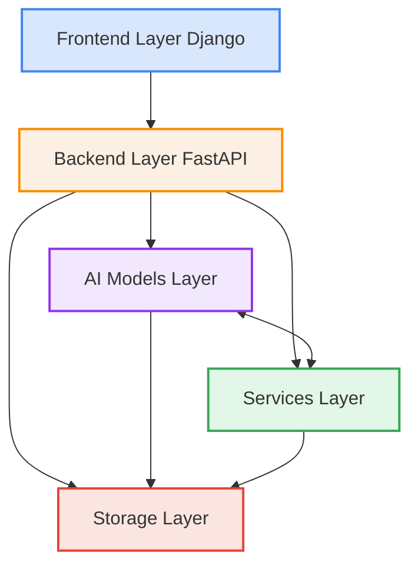
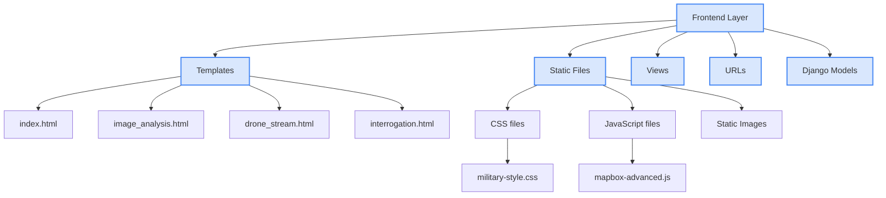
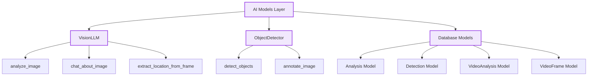
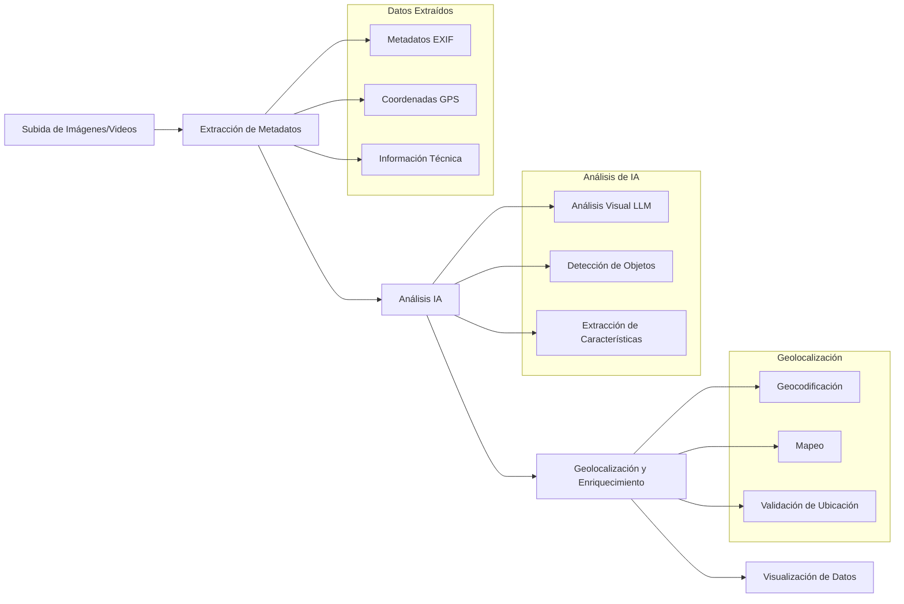
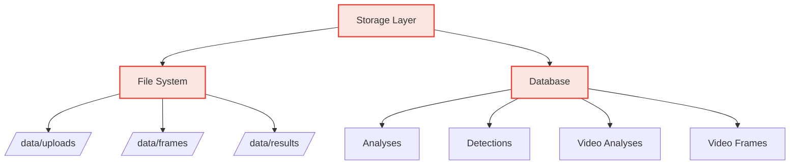
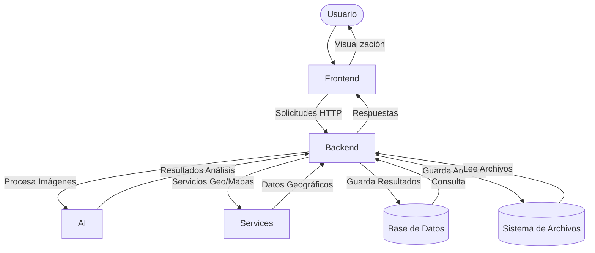

# Arquitectura de Drone-OSINT-GeoSpy

## Visión General del Sistema

Drone-OSINT-GeoSpy es una plataforma avanzada para el análisis geoespacial e inteligencia de imágenes capturadas por drones, combinando modelos de IA avanzados con servicios de geolocalización.

## Capas de la Arquitectura



## Componentes Principales

### 1. Frontend (Django)



#### Componentes del Frontend
- **Templates**: Interfaces de usuario HTML
  - `index.html`: Página principal
  - `image_analysis.html`: Análisis de imágenes
  - `drone_stream.html`: Stream de drones en tiempo real
  - `interrogation.html`: Chat interactivo con imágenes
- **Static Files**: Recursos estáticos
  - CSS: Estilos visuales incluyendo `military-style.css`
  - JavaScript: Funcionalidades front-end incluyendo `mapbox-advanced.js`
  - Imágenes: Recursos visuales
- **Views**: Controladores de la vista Django
- **URLs**: Mapeo de rutas
- **Models**: Modelos ORM Django

### 2. Backend (FastAPI)

```mermaid
graph TD
    classDef backend fill:#fcefe3,stroke:#FB8C00,stroke-width:2px
    
    Backend[Backend Layer]:::backend
    Controllers[API Controllers]:::backend
    Uploads[Image/Video Upload]:::backend
    Analysis[Analysis Endpoints]:::backend
    Chat[Chat API]:::backend
    Detection[Object Detection API]:::backend
    
    Backend --> Controllers
    Controllers --> Uploads
    Controllers --> Analysis
    Controllers --> Chat
    Controllers --> Detection
    
    Uploads --> image_upload[/api/upload/image]
    Uploads --> video_upload[/api/upload/video]
    
    Analysis --> analyze_image[/api/analyze/image/{id}]
    Analysis --> extract_metadata[/api/metadata/{id}]
    
    Chat --> chat_image[/api/chat/image/{id}]
    
    Detection --> detect_objects[/api/detect/objects]
    Detection --> annotated_image[/api/image/annotated/{id}]
```

#### Componentes del Backend
- **API Controllers**: Controladores FastAPI
  - `image_controller.py`: Gestión de imágenes
  - `detection_controller.py`: Detección de objetos
  - `video_controller.py`: Procesamiento de video
- **Endpoints de Subida**: Endpoints para carga de archivos
  - `/api/upload/image`: Subida de imágenes
  - `/api/upload/video`: Subida de videos
- **Endpoints de Análisis**: Procesamiento de datos
  - `/api/analyze/image/{id}`: Análisis de imágenes
  - `/api/metadata/{id}`: Extracción de metadatos
- **Chat API**: Interfaces conversacionales
  - `/api/chat/image/{id}`: Chat sobre imágenes
- **API de Detección**: Detección de objetos
  - `/api/detect/objects`: Análisis de objetos
  - `/api/image/annotated/{id}`: Imágenes anotadas

### 3. Modelos de IA



#### Componentes de los Modelos de IA
- **VisionLLM (Gemini 2.5)**: Análisis de visión avanzado
  - `analyze_image()`: Análisis estructurado de imágenes
  - `chat_about_image()`: Chat interactivo basado en imágenes
  - `extract_location_from_frame()`: Extracción de ubicación de frames
- **ObjectDetector (YOLOv8)**: Detección de objetos
  - `detect_objects()`: Identificación de objetos en imágenes
  - `annotate_image()`: Anotación visual de detecciones
- **Modelos de Base de Datos**: Persistencia de datos
  - `Analysis`: Almacenamiento de resultados de análisis
  - `Detection`: Registro de objetos detectados
  - `VideoAnalysis`: Análisis de videos
  - `VideoFrame`: Análisis de fotogramas individuales

### 4. Servicios

```mermaid
graph TD
    classDef services fill:#e2f7e8,stroke:#34A853,stroke-width:2px
    
    Services[Services Layer]:::services
    GeoService[GeoService]:::services
    MapboxService[MapboxService]:::services
    VideoProcessor[VideoProcessor]:::services
    MetadataExtractor[MetadataExtractor]:::services
    ImageOptimizer[ImageOptimizer]:::services
    
    Services --> GeoService
    Services --> MapboxService
    Services --> VideoProcessor
    Services --> MetadataExtractor
    Services --> ImageOptimizer
    
    GeoService --> get_location[get_location_from_coordinates]
    GeoService --> enhance_geo[enhance_with_google_maps]
    GeoService --> generate_map[generate_map]
    GeoService --> merge_location[merge_location_data]
    
    MapboxService --> generate_static[generate_static_map]
    MapboxService --> generate_interactive[generate_interactive_map]
    
    VideoProcessor --> extract_frames[extract_frames]
    VideoProcessor --> process_stream[process_stream]
    
    MetadataExtractor --> extract_metadata[extract_metadata]
    MetadataExtractor --> extract_gps[extract_gps_coordinates]
    
    ImageOptimizer --> process_image[process_image]
    ImageOptimizer --> enhance_image[enhance_image]
```



#### Componentes de Servicios
- **GeoService**: Servicios de geolocalización
  - `get_location_from_coordinates()`: Geocodificación inversa
  - `enhance_with_google_maps()`: Enriquecimiento con Google Maps
  - `generate_map()`: Generación de mapas
  - `merge_location_data()`: Integración de datos geográficos
- **MapboxService**: Visualización cartográfica
  - `generate_static_map()`: Mapas estáticos
  - `generate_interactive_map()`: Mapas interactivos
- **VideoProcessor**: Procesamiento de video
  - `extract_frames()`: Extracción de fotogramas
  - `process_stream()`: Procesamiento de streams en vivo
- **MetadataExtractor**: Extracción de metadatos
  - `extract_metadata()`: Extracción de datos EXIF
  - `extract_gps_coordinates()`: Extracción de coordenadas GPS
- **ImageOptimizer**: Optimización de imágenes
  - `process_image()`: Preprocesamiento de imágenes
  - `enhance_image()`: Mejora de calidad de imagen

## Flujo de Datos



## Almacenamiento de Datos



| Tipo | Almacenamiento | Descripción |
|------|----------------|-------------|
| **Imágenes Originales** | `/data/uploads/` | Archivos subidos por el usuario |
| **Frames de Video** | `/data/frames/` | Fotogramas extraídos de videos |
| **Resultados Procesados** | `/data/results/` | Imágenes anotadas y procesadas |
| **Análisis** | Base de Datos (Analysis) | Resultados del análisis de VisionLLM |
| **Detecciones** | Base de Datos (Detection) | Objetos detectados en imágenes |
| **Análisis de Video** | Base de Datos (VideoAnalysis) | Metadatos de videos procesados |
| **Frames Analizados** | Base de Datos (VideoFrame) | Análisis de fotogramas individuales |

## Integración de Componentes



## Componentes Detallados

### 1. VisionLLM (Análisis de Visión)

**Descripción**: Motor central de análisis de imágenes, utiliza Google Gemini 2.5 Pro para extraer información semántica y geográfica de imágenes de drones.

**Capacidades**:
- Análisis de imágenes para extracción de información geoespacial
- Identificación de características arquitectónicas y del paisaje
- Estimación de coordenadas geográficas basada en características visuales
- Interfaz conversacional para consultas específicas sobre imágenes
- Procesamiento de fotogramas de video para análisis secuencial

**Interfaz**:
```python
class VisionLLM:
    def analyze_image(image_path: str) -> Dict[str, Any]
    def chat_about_image(image_path: str, user_message: str) -> Dict[str, Any]
    def extract_location_from_frame(video_frame_path: str) -> Dict[str, Any]
```

### 2. ObjectDetector (Detección de Objetos)

**Descripción**: Sistema de detección de objetos basado en YOLOv8 para identificar y clasificar elementos en imágenes de drones.

**Capacidades**:
- Detección de personas, vehículos y otros objetos relevantes
- Anotación visual de detecciones sobre imágenes
- Generación de estadísticas de objetos detectados
- Configuración de umbral de confianza para detecciones
- Selección de diferentes modelos por tamaño/precisión

**Interfaz**:
```python
class ObjectDetector:
    def __init__(model_size="large", confidence=0.25)
    def detect_objects(image_path: str) -> Dict[str, Any]
    def annotate_image(image_path: str, results: Dict) -> str
```

### 3. GeoService (Servicios Geoespaciales)

**Descripción**: Conjunto de servicios para procesamiento, validación y enriquecimiento de información geográfica.

**Capacidades**:
- Geocodificación inversa (coordenadas a direcciones)
- Validación de coordenadas extraídas por IA con datos GPS de metadatos
- Generación de mapas estáticos e interactivos
- Fusión de datos geográficos de múltiples fuentes
- Cálculo de distancias y precisión de geolocalización

**Interfaz**:
```python
class GeoService:
    def get_location_from_coordinates(latitude: float, longitude: float) -> Dict[str, Any]
    def enhance_with_google_maps(latitude: float, longitude: float) -> Dict[str, Any]
    def generate_map(latitude: float, longitude: float, zoom: int) -> str
    def merge_location_data(llm_data: Dict, metadata_gps: Dict) -> Dict[str, Any]
```

### 4. VideoProcessor (Procesamiento de Video)

**Descripción**: Servicio especializado en el procesamiento de contenido de video para análisis.

**Capacidades**:
- Extracción de fotogramas a intervalos definidos
- Procesamiento de transmisiones en vivo de drones
- Generación de secuencias temporales para análisis
- Captura y gestión de streams en tiempo real
- Conversión de frames para análisis con VisionLLM

**Interfaz**:
```python
class VideoProcessor:
    def extract_frames(video_path: str, interval_sec: float, max_frames: int) -> List[str]
    def get_frame_generator(video_path: str, interval_sec: float) -> Generator
    def get_latest_frame() -> Optional[Tuple[np.ndarray, str]]
```

### 5. MetadataExtractor (Extracción de Metadatos)

**Descripción**: Servicio para extraer y procesar metadatos incrustados en imágenes digitales.

**Capacidades**:
- Extracción de datos EXIF completos de imágenes
- Obtención de coordenadas GPS de metadatos
- Conversión de formatos de coordenadas a decimal
- Extracción de información de cámara y condiciones de captura
- Obtención de dimensiones y resolución de imágenes

**Interfaz**:
```python
class MetadataExtractor:
    @staticmethod
    def extract_metadata(image_path: str) -> Dict[str, Any]
    @staticmethod
    def extract_gps_coordinates(tags: Dict) -> Optional[Dict[str, Any]]
    @staticmethod
    def get_image_dimensions(metadata: Dict) -> Optional[Tuple[int, int]]
```

## Casos de Uso Principales

1. **Análisis de Imágenes de Drone**
   - Subida de imagen desde interfaz frontend
   - Extracción automática de metadatos
   - Análisis con VisionLLM para identificar ubicación
   - Detección de objetos en la imagen
   - Visualización de resultados en mapa interactivo

2. **Análisis de Video de Drone**
   - Subida de video desde interfaz
   - Extracción de fotogramas representativos
   - Análisis secuencial de frames con VisionLLM
   - Seguimiento de trayectoria en mapa
   - Detección de cambios de escena o ubicación

3. **Chat Interactivo con Imágenes**
   - Selección de imagen analizada
   - Formulación de preguntas sobre la imagen
   - Procesamiento de consultas con VisionLLM
   - Visualización de respuestas con referencias a la imagen
   - Exploración interactiva de características

4. **Detección y Seguimiento de Objetos**
   - Procesamiento de imagen con ObjectDetector
   - Identificación de personas y vehículos
   - Anotación visual de objetos detectados
   - Generación de estadísticas de objetos
   - Visualización de resultados en interfaz

## Tecnologías Utilizadas

| Componente | Tecnologías |
|------------|-------------|
| **Frontend** | Django, HTML/CSS, JavaScript, Mapbox GL JS |
| **Backend** | FastAPI, Uvicorn, Python 3.9+ |
| **IA** | Google Gemini 2.5 Pro, YOLOv8, OpenCV |
| **Geolocalización** | Nominatim, Google Maps API, Mapbox API |
| **Base de Datos** | SQLAlchemy, SQLite/PostgreSQL |
| **Procesamiento** | PIL/Pillow, NumPy, OpenCV |
| **Otros** | Docker, Exifread, Folium |