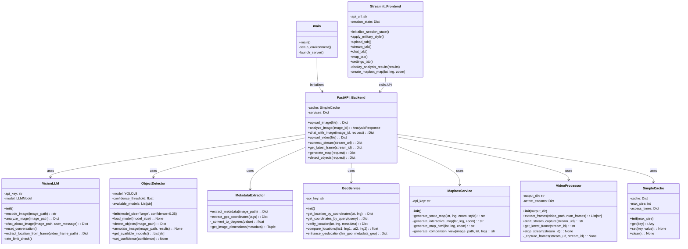

```mermaid
classDiagram
    class main {
        +main()
        -setup_environment()
        -launch_server()
    }
    
    class VisionLLM {
        -api_key: str
        -model: LLMModel
        +__init__()
        +encode_image(image_path): str
        +analyze_image(image_path): Dict
        +chat_about_image(image_path, user_message): Dict
        +reset_conversation()
        +extract_location_from_frame(video_frame_path): Dict
        -rate_limit_check()
    }
    
    class ObjectDetector {
        -model: YOLOv8
        -confidence_threshold: float
        -available_models: List[str]
        +__init__(model_size="large", confidence=0.25)
        +load_model(model_size): None
        +detect_objects(image_path): Dict
        +annotate_image(image_path, results): None
        +get_available_models(): List[str]
        +set_confidence(confidence): None
    }
    
    class MetadataExtractor {
        +extract_metadata(image_path): Dict
        +extract_gps_coordinates(tags): Dict
        -_convert_to_degrees(value): float
        +get_image_dimensions(metadata): Tuple
    }
    
    class GeoService {
        -api_key: str
        +__init__()
        +get_location_by_coordinates(lat, lng): Dict
        +get_coordinates_by_query(query): Dict
        +verify_location(lat, lng, metadata): Dict
        +compare_locations(lat1, lng1, lat2, lng2): float
        +enhance_geolocation(llm_geo, metadata_geo): Dict
    }
    
    class MapboxService {
        -api_key: str
        +__init__()
        +generate_static_map(lat, lng, zoom, style): str
        +generate_interactive_map(lat, lng, zoom): str
        +generate_map_html(lat, lng, zoom): str
        +generate_comparison_view(image_path, lat, lng): str
    }
    
    class VideoProcessor {
        -output_dir: str
        -active_streams: Dict
        +__init__(output_dir)
        +extract_frames(video_path, num_frames): List[str]
        +start_stream_capture(stream_url): str
        +get_latest_frame(stream_id): str
        +stop_stream(stream_id): None
        -_capture_frames(stream_url, stream_id): None
    }
    
    class FastAPI_Backend {
        -cache: SimpleCache
        -services: Dict
        +upload_image(file): Dict
        +analyze_image(image_id): AnalysisResponse
        +chat_with_image(image_id, request): Dict
        +upload_video(file): Dict
        +connect_stream(stream_url): Dict
        +get_latest_frame(stream_id): Dict
        +generate_map(request): Dict
        +detect_objects(request): Dict
    }
    
    class Streamlit_Frontend {
        -api_url: str
        -session_state: Dict
        +initialize_session_state()
        +apply_military_style()
        +upload_tab()
        +stream_tab()
        +chat_tab()
        +map_tab()
        +settings_tab()
        -display_analysis_results(results)
        -create_mapbox_map(lat, lng, zoom)
    }
    
    class SimpleCache {
        -cache: Dict
        -max_size: int
        -access_times: Dict
        +__init__(max_size)
        +get(key): Any
        +set(key, value): None
        +clear(): None
    }
    
    main --> FastAPI_Backend : initializes
    FastAPI_Backend --> VisionLLM : uses
    FastAPI_Backend --> ObjectDetector : uses
    FastAPI_Backend --> MetadataExtractor : uses
    FastAPI_Backend --> GeoService : uses
    FastAPI_Backend --> MapboxService : uses
    FastAPI_Backend --> VideoProcessor : uses
    FastAPI_Backend --> SimpleCache : uses
    Streamlit_Frontend --> FastAPI_Backend : calls API
``` 