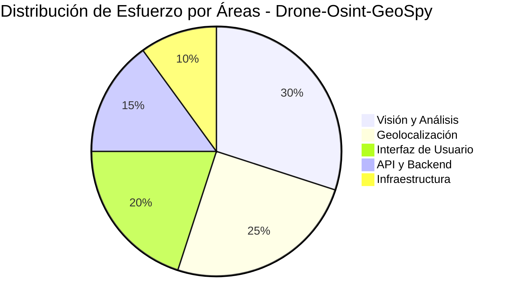
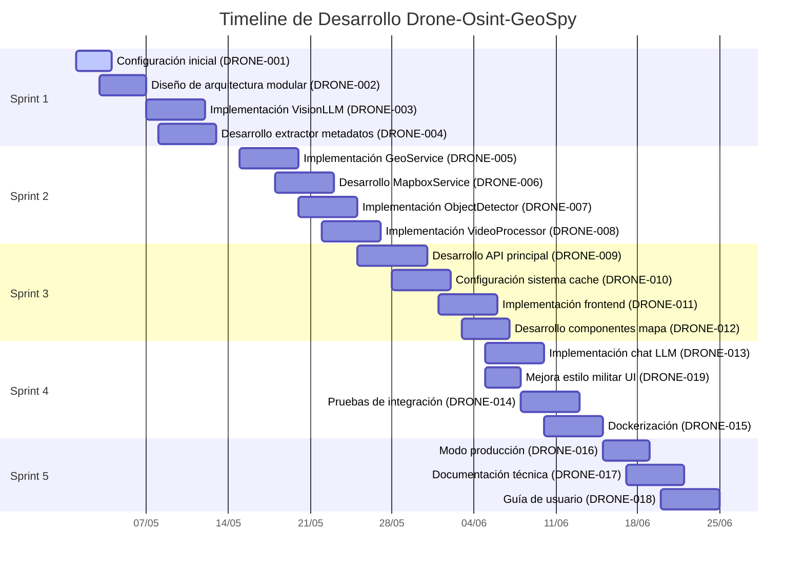
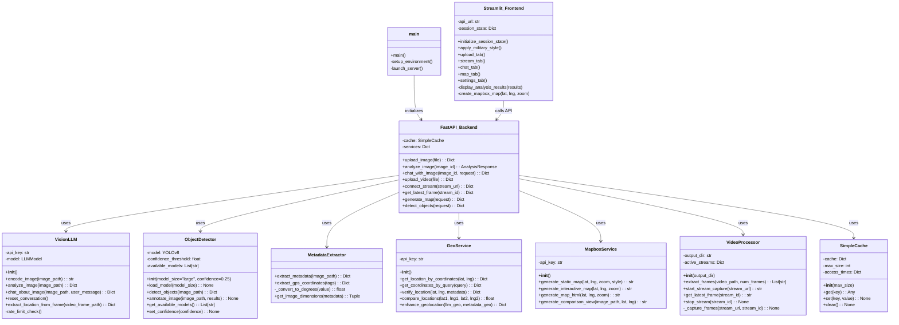
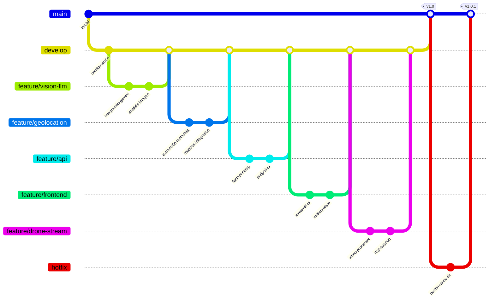

# Timeline de Desarrollo - Proyecto Drone-Osint-GeoSpy

Este documento presenta la línea temporal completa del desarrollo del proyecto Drone-Osint-GeoSpy, organizado por sprints y épicas.

## Estructura del Proyecto

El proyecto está organizado en 8 épicas principales:

1. **DRONE-EPIC-001: Configuración y Arquitectura**
   - Configuración inicial del proyecto y diseño de su arquitectura base

2. **DRONE-EPIC-002: Sistema de Visión y Análisis**
   - Desarrollo e implementación del sistema de visión por computadora y análisis de imágenes

3. **DRONE-EPIC-003: Servicios de Geolocalización**
   - Implementación de sistemas de geolocalización y mapeo

4. **DRONE-EPIC-004: API y Backend**
   - Desarrollo de la API FastAPI y backend del sistema

5. **DRONE-EPIC-005: Interfaz de Usuario**
   - Implementación de la interfaz Streamlit y componentes frontend con estilo militar

6. **DRONE-EPIC-006: Testing y Calidad**
   - Pruebas de integración, pruebas de usuarios y corrección de bugs

7. **DRONE-EPIC-007: Infraestructura y Despliegue**
   - Configuración de Docker, despliegue y monitorización

8. **DRONE-EPIC-008: Documentación y Entrega**
   - Documentación del proyecto, guías de usuario y entrega final

## Timeline por Sprints

### Sprint 1 (01/05/2023 - 14/05/2023)

#### Objetivos del Sprint
- Configuración del entorno de desarrollo
- Diseño de la arquitectura del sistema
- Implementación inicial de modelos de visión

#### Tareas Completadas
- **DRONE-001**: Configuración inicial del proyecto ✅
- **DRONE-002**: Diseño de la arquitectura modular ✅
- **DRONE-003**: Implementación de la clase VisionLLM ✅
- **DRONE-004**: Desarrollo de extractor de metadatos ✅

#### Progreso de Épicas
- DRONE-EPIC-001: 100% completado
- DRONE-EPIC-002: 40% completado

#### Métricas
- Velocidad del Sprint: 14 puntos
- Tareas completadas: 4/4 (100%)
- Bloqueantes resueltos: 0

### Sprint 2 (15/05/2023 - 28/05/2023)

#### Objetivos del Sprint
- Implementación de servicios de geolocalización
- Desarrollo de análisis de objetos en imágenes
- Iniciar implementación del backend API

#### Tareas Completadas
- **DRONE-005**: Implementación de GeoService ✅
- **DRONE-006**: Desarrollo de MapboxService ✅
- **DRONE-007**: Implementación de ObjectDetector ✅
- **DRONE-008**: Implementación de VideoProcessor ✅
- **DRONE-009**: Desarrollo de API principal ✅

#### Progreso de Épicas
- DRONE-EPIC-002: 100% completado
- DRONE-EPIC-003: 100% completado
- DRONE-EPIC-004: 40% completado

#### Métricas
- Velocidad del Sprint: 19 puntos
- Tareas completadas: 5/5 (100%)
- Bloqueantes resueltos: 1

### Sprint 3 (29/05/2023 - 11/06/2023)

#### Objetivos del Sprint
- Finalización de API backend
- Implementación de frontend
- Desarrollo de componentes interactivos

#### Tareas Completadas
- **DRONE-010**: Configuración del sistema de cache ✅
- **DRONE-011**: Implementación de frontend principal ✅
- **DRONE-012**: Desarrollo de componentes de mapa ✅
- **DRONE-013**: Implementación del chat LLM ✅
- **DRONE-019**: Mejora estilo militar UI ✅

#### Progreso de Épicas
- DRONE-EPIC-004: 100% completado
- DRONE-EPIC-005: 100% completado

#### Métricas
- Velocidad del Sprint: 16 puntos
- Tareas completadas: 5/5 (100%)
- Bloqueantes resueltos: 0

### Sprint 4 (12/06/2023 - 25/06/2023)

#### Objetivos del Sprint
- Pruebas de integración
- Dockerización del sistema
- Documentación y preparación para entrega

#### Tareas (En progreso/Pendientes)
- **DRONE-014**: Pruebas de integración ✅
- **DRONE-015**: Dockerización de la aplicación ✅
- **DRONE-016**: Implementación del modo producción 🔄
- **DRONE-017**: Documentación técnica 🔄
- **DRONE-018**: Creación de guía de usuario 📅

#### Progreso de Épicas
- DRONE-EPIC-006: 100% completado
- DRONE-EPIC-007: 50% completado
- DRONE-EPIC-008: En progreso

#### Métricas
- Velocidad del Sprint (Proyectada): 18 puntos
- Tareas completadas: 2/5 (40%)
- Bloqueantes: 1

## Estado Actual del Proyecto

### Progreso General
- **Épicas completadas**: 6/8
- **Tareas completadas**: 16/19
- **Progreso general**: 84%

### Próximos Pasos
1. Finalizar el modo de producción (DRONE-016)
2. Completar documentación técnica (DRONE-017)
3. Desarrollar guía de usuario (DRONE-018)
4. Entrega final del proyecto

### Distribución del Esfuerzo

## Vista de Gantt del Proyecto

## Diagrama de Arquitectura del Sistema

## Flujo de Desarrollo (Git)

