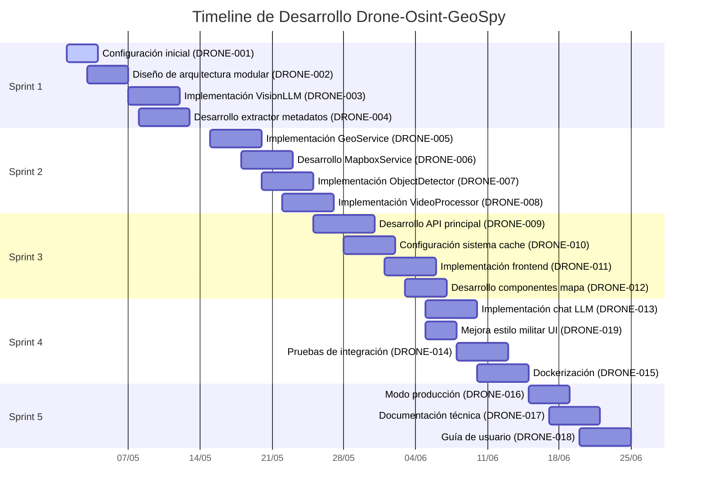

```mermaid
gantt
    title Timeline de Desarrollo Drone-Osint-GeoSpy
    dateFormat  YYYY-MM-DD
    axisFormat %d/%m
    
    section Sprint 1
    Configuración inicial (DRONE-001)      :active, a1, 2023-05-01, 3d
    Diseño de arquitectura modular (DRONE-002)     :a2, 2023-05-03, 4d
    Implementación VisionLLM (DRONE-003)   :a3, 2023-05-07, 5d
    Desarrollo extractor metadatos (DRONE-004) :a4, 2023-05-08, 5d
    
    section Sprint 2
    Implementación GeoService (DRONE-005) :b1, 2023-05-15, 5d
    Desarrollo MapboxService (DRONE-006)  :b2, 2023-05-18, 5d
    Implementación ObjectDetector (DRONE-007) :b3, 2023-05-20, 5d
    Implementación VideoProcessor (DRONE-008) :b4, 2023-05-22, 5d
    
    section Sprint 3
    Desarrollo API principal (DRONE-009) :c1, 2023-05-25, 6d
    Configuración sistema cache (DRONE-010) :c2, 2023-05-28, 5d
    Implementación frontend (DRONE-011)     :c3, 2023-06-01, 5d
    Desarrollo componentes mapa (DRONE-012)    :c4, 2023-06-03, 4d
    
    section Sprint 4
    Implementación chat LLM (DRONE-013)    :d1, 2023-06-05, 5d
    Mejora estilo militar UI (DRONE-019) :d2, 2023-06-05, 3d
    Pruebas de integración (DRONE-014) :d3, 2023-06-08, 5d
    Dockerización (DRONE-015)     :d4, 2023-06-10, 5d
    
    section Sprint 5
    Modo producción (DRONE-016) :e1, 2023-06-15, 4d
    Documentación técnica (DRONE-017)     :e2, 2023-06-17, 5d
    Guía de usuario (DRONE-018)     :e3, 2023-06-20, 5d
```