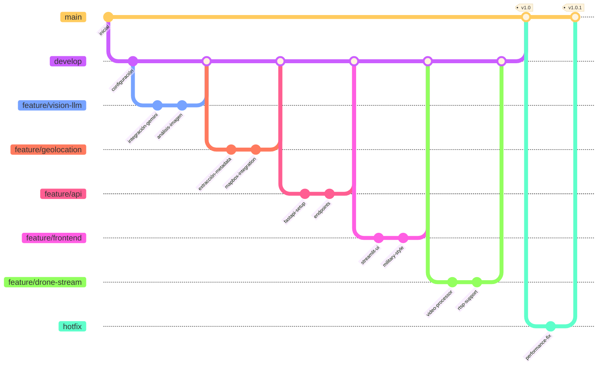

```mermaid
%%{init: { 'logLevel': 'debug', 'theme': 'base', 'gitGraph': {'showBranches': true, 'showCommitLabel':true}} }%%
gitGraph
    commit id: "inicial"
    branch develop
    checkout develop
    commit id: "configuración"
    branch feature/vision-llm
    checkout feature/vision-llm
    commit id: "integración-gemini"
    commit id: "análisis-imagen"
    checkout develop
    merge feature/vision-llm
    branch feature/geolocation
    checkout feature/geolocation
    commit id: "extracción-metadata"
    commit id: "mapbox-integration"
    checkout develop
    merge feature/geolocation
    branch feature/api
    checkout feature/api
    commit id: "fastapi-setup"
    commit id: "endpoints"
    checkout develop
    merge feature/api
    branch feature/frontend
    checkout feature/frontend
    commit id: "streamlit-ui"
    commit id: "military-style"
    checkout develop
    merge feature/frontend
    branch feature/drone-stream
    checkout feature/drone-stream
    commit id: "video-processor"
    commit id: "rtsp-support"
    checkout develop
    merge feature/drone-stream
    checkout main
    merge develop tag: "v1.0"
    branch hotfix
    checkout hotfix
    commit id: "performance-fix"
    checkout main
    merge hotfix tag: "v1.0.1"
``` 