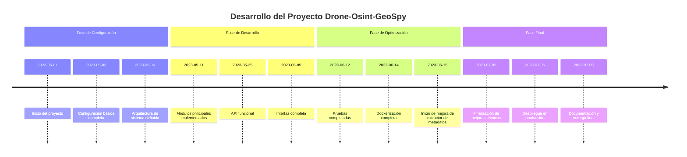

```mermaid
timeline
    title Desarrollo del Proyecto Drone-Osint-GeoSpy
    section Fase de Configuración
        2023-05-01 : Inicio del proyecto
        2023-05-03 : Configuración básica completa
        2023-05-06 : Arquitectura de sistema definida
    section Fase de Desarrollo
        2023-05-11 : Módulos principales implementados 
        2023-05-25 : API funcional
        2023-06-05 : Interfaz completa
    section Fase de Optimización
        2023-06-12 : Pruebas completadas
        2023-06-14 : Dockerización completa
        2023-06-15 : Inicio de mejora de extractor de metadatos
    section Fase Final
        2023-07-02 : Finalización de mejoras técnicas
        2023-07-05 : Despliegue en producción
        2023-07-09 : Documentación y entrega final
``` 